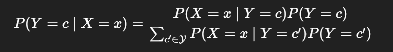
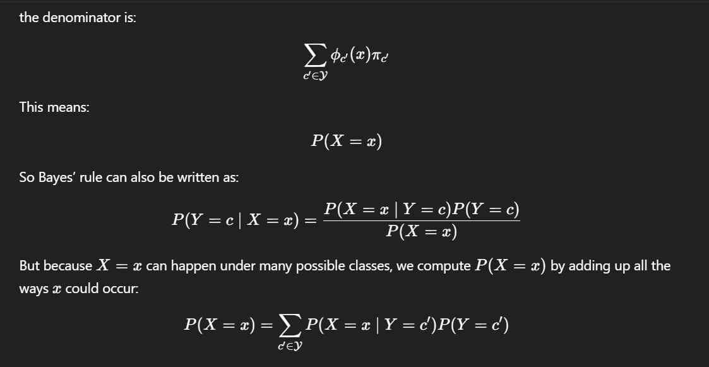

# Naive Bayes Classifier 
The Naive Bayes Classifier is a simple yet powerful probabilistic machine learning algorithm used for classification tasks. It is based on Bayes' Theorem and assumes that the `features in the dataset are independent of each other` (hence the "naive" assumption). Despite this simplification, it often performs well in real-world applications, especially with large datasets.
Naive Bayes is particularly popular for text classification problems, such as spam filtering, sentiment analysis, and document categorization. It is fast, efficient, and requires minimal training data compared to more complex models.
---
## Bayes' Theorem
The core of Naive Bayes is Bayes' Theorem, which calculates the probability of a class given the features:
$$P(C|X) = \frac{P(X|C) \cdot P(C)}{P(X)}$$

$  P(C|X)  $: Posterior probability of class $  C  $ given features $  X  $.
$  P(X|C)  $: Likelihood of features $  X  $ given class $  C  $.
$  P(C)  $: Prior probability of class $  C  $.
$  P(X)  $: Evidence (probability of features $  X  $). In practice, since $  P(X)  $ is constant for all classes, we can ignore it and focus on maximizing $  P(X|C) \cdot P(C)  $.

**Naive Assumption**
The algorithm assumes independence among features, so the likelihood $  P(X|C)  $ is the product of individual feature probabilities:
$$P(X|C) = \prod_{i=1}^{n} P(x_i|C)$$

---

##  Overview
The Naive Bayes Classifier is a simple yet powerful probabilistic machine learning algorithm used for classification tasks. It is based on Bayes' Theorem and assumes that the features in the dataset are independent of each other (hence the `naive` assumption). Despite this simplification, it often performs well in real-world applications, especially with large datasets.
Naive Bayes is particularly popular for text classification problems, such as spam filtering, sentiment analysis, and document categorization. It is fast, efficient, and requires minimal training data compared to more complex models.
### How It Works
The core of Naive Bayes is Bayes' Theorem, which calculates the probability of a class given the features:
$$P(C|X) = \frac{P(X|C) \cdot P(C)}{P(X)}$$

$  P(C|X)  $: Posterior probability of class $  C  $ given features $  X  $.
$  P(X|C)  $: Likelihood of features $  X  $ given class $  C  $.
$  P(C)  $: Prior probability of class $  C  $.
$  P(X)  $: Evidence (probability of features $  X  $).

In practice, since $  P(X)  $ is constant for all classes, we can ignore it and focus on maximizing $  P(X|C) \cdot P(C)  $.
Naive Assumption
The algorithm assumes independence among features, so the likelihood $  P(X|C)  $ is the product of individual feature probabilities:
$$P(X|C) = \prod_{i=1}^{n} P(x_i|C)$$
Where $  x_i  $ are the individual features.
Classification
For a new instance, compute the posterior for each class and assign the class with the highest probability.
Types of Naive Bayes Classifiers

 - *Gaussian Naive Bayes*:
Assumes features follow a normal (Gaussian) distribution.
Suitable for continuous data.
Example: Predicting iris species based on petal lengths.

 - *Multinomial Naive Bayes*:
Assumes features follow a multinomial distribution.
Ideal for discrete data, like word counts in text.
Common in NLP tasks, such as spam detection.

 - *Bernoulli Naive Bayes*:
Assumes features are binary (0 or 1).
Used for binary/boolean features, like word presence/absence in documents.

Advantages

Simple and Fast: Easy to implement and computationally efficient.
Handles High-Dimensional Data: Performs well with many features (e.g., text data).
Requires Less Data: Works with small training sets due to its probabilistic nature.
Good for Multiclass Problems: Naturally supports multiple classes.

Disadvantages

Independence Assumption: Rarely holds in real data, which can lead to suboptimal performance.
Zero Probability Issue: If a feature value wasn't seen in training, its probability is zero (mitigated by Laplace smoothing).
Poor Estimator: While good at classification, the probability estimates may be inaccurate.
Sensitive to Irrelevant Features: Can degrade performance if features aren't independent.

---
Naive Bayes works surprisingly well in many real-world problems, especially when the feature independence assumption is close to true or not critical. Here's when it shines:

- Text Classification / NLP  Spam detection,Sentiment analysis (positive/negative),Topic categorization, Language detection
- Works well because text data (bag-of-words) naturally fits the assumption of feature independence.
- Document or Email Classification. Each word is a feature, and the presence/absence of words is modeled well with Multinomial or Bernoulli Naive Bayes.
- Medical Diagnosis Symptoms (features) often contribute independently to the diagnosis (class).
- Especially useful when data is categorical or binary (e.g., yes/no symptoms).
- Recommendation Systems (Basic) Predicting user preferences
- Real-time Predictions Due to its speed, it's great for systems that require fast inference 

Correlated features              	                        Assumption of independence breaks
Complex interactions between inputs	                        No feature interaction modeled
Continuous numerical data with non-Gaussian distribution	GaussianNB may perform poorly
High accuracy needed with tight constraints	                May be outperformed by trees, SVM, or deep models

encode the categorical features

---

The Naive Bayes classifier is a *probabilistic classification algorithm* based on *Bayes’ theorem*.
`naive` because it assumes that features are conditionally independent given the class,an assumption that is often false, but surprisingly effective in practice.
Given the class label, each feature is independent of the others.
The predicted class is the one with the highest posterior probability.

*Prior*
**A class prior is just your belief about how common each class is before you look at any features.**
“Before I see any data about this example, how likely is each class?”

*Posterior*
“Given what I see, how likely is this class?”

If spam is very common (70%), the same evidence should push you toward spam much more strongly.

If you treat all classes as equally likely when they are not, your model may:

Overpredict rare classes
Underpredict common classes
Produce misleading probabilities

---

### How this differs from logistic regression
Naive Bayes: priors are explicit and visible
Logistic regression: priors are implicit, absorbed into the intercept term
The concept exists in both, but Naive Bayes makes it obvious.

---

### Limitations of naive bayes classifier

 - Independence assumption is often unrealistic
 - Poor probability calibration
 - Struggles when features are strongly correlated
 - Decision boundaries are simplistic

---

 

$$ϕc​(x)=P(X=x∣Y=c) $$

is the likelihood of seeing input x in class c

$$πc = P(Y=c) $$

is the prior probability of class c.

The denominator is the total probability of seeing the observed input x, considering all possible classes.

 

It also acts as a normalizing constant. The numerator gives the score for one class, and the denominator makes sure all class probabilities add up to 1.

it answers:  Given that we observed features X = x, what is the probability that the class is Y = c?

example:
suppose we want to  classify something as 0 or 1
Y  ∈ {0,1}

We have a total of 50 elements, 35 belongs to class 1, 15 to class 0.

P(0) = 0.3, P(1) = 0.7

x1 is an observed feature. 

Suppose that
P(x1 | 0) = 0.8
and 
P(x1 | 1) = 0.2 
so the  feature x is much more likely in class 0.

                           P(x1 | 1) *  P(1)                      0.2*0.7
P(1 | x1)  =   ___________________________________________  = ________________________  = 0.4375
                  P(x1 | 1) *  P(1) + P(x1 | 0) *  P(0)        0.2*0.7 + 0.8*0.3

                           P(x1 | 0) *  P(0)                      0.8*0.3
P(0 | x1)  =   ___________________________________________  = ________________________  = 0.631
                  P(x1 | 1) *  P(1) + P(x1 | 0) *  P(0)        0.2*0.7 + 0.8*0.3

P(X = x|Y = c) is the likelyhood function.It measures given the class c how likely is to
observe x

It measures given the class c how likely is to
observe x

Given the likelyhood function and the Prior probability by applying the Bayes rule it is possible
to obtain the A-Posteriori probaility (Posterior) P(Y = c|X = x).

### classification strategies
given a labelled dataset D = (xi,yi) i=,..,N
and k classes ci

givn a tst sampl x':
 
Maximum Likelyhood Classification
-Learn from D a likelyhood function for every class ci P(x|ci)
-given xˆ evaluate the sample against the k likelyhood functions
-cˆ = argmaxcP(ˆx|c)

Maximum A-Posteriori Classification:
-Learn from D a likelyhood function for every class ci P(x|ci)
-Learn from D the prior probability for every class ci P(ci)

e